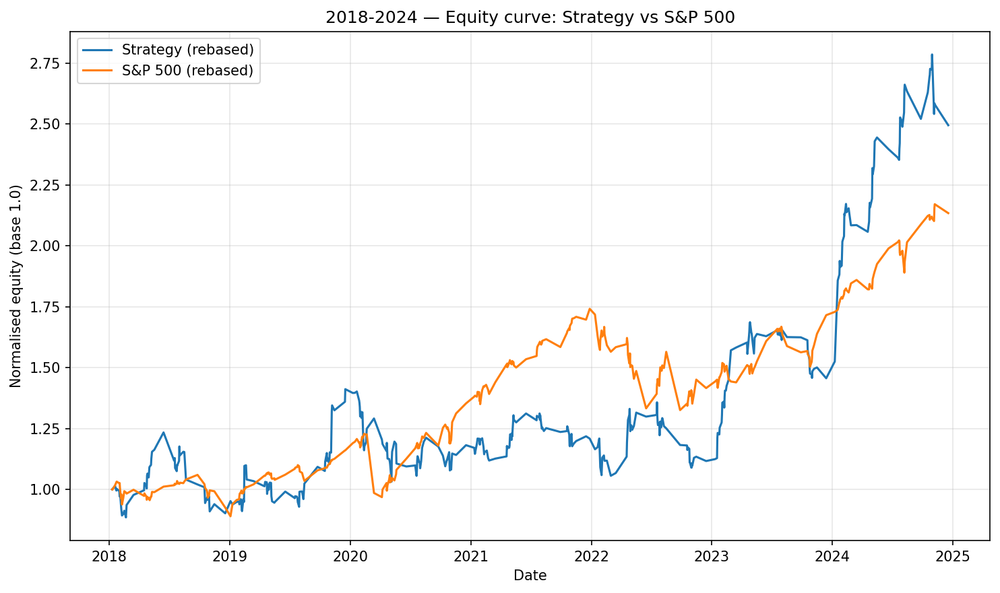
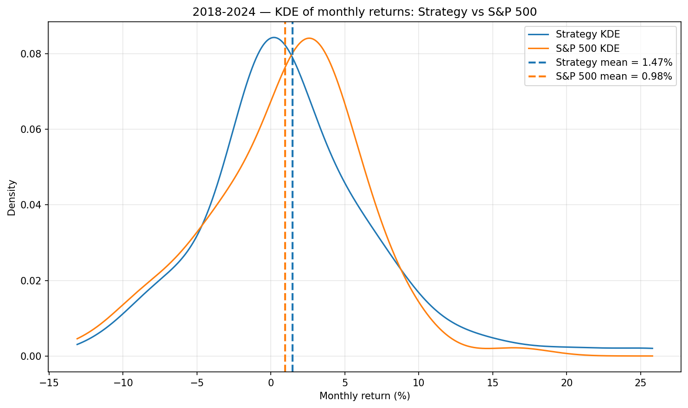

#  Post-Earnings Momentum Strategy — Pipeline & Analysis

This repository contains the full implementation of an **event-driven post-earnings momentum strategy**, developed as an applied quantitative finance project.  
The objective is to study whether **stock-specific momentum effects following earnings announcements** can be systematically identified and translated into a profitable out-of-sample trading strategy.

The project follows a **clean, reproducible execution pipeline**, from earnings-level signal construction to portfolio backtesting and performance evaluation.

---

##   Key Idea

Earnings announcements are among the most impactful events in financial markets.

This project explores whether:
- Price reactions show **consistent patterns**
- These patterns can be **quantified statistically**
- They can be used to build **systematic strategies**
---

## Economic Intuition

Markets do not always fully incorporate information instantly.

This leads to:
- **Post-earnings drift(PEAD)**
- **Momentum continuation**
- Behavioral effects (underreaction / overreaction)

This project aims to detect patterns with a statistical edge in historical earnings data and assess their generalization to out-of-sample periods.


---

##  Methodology Overview

- Earnings announcements are aligned to the **next trading day**.
- For each earnings event, two returns are computed:
  - **Close → Open** (% of overnight reaction)
  - **Open → Close** (% of intraday continuation or reversal of the next day)
- Each event is classified into one of four **post-earnings quadrants**:
  - `pos_then_up`
  - `pos_then_down`
  - `neg_then_up`
  - `neg_then_down`
- A **momentum bias metric** is computed for each stock, capturing the tendency of post-earnings continuation patterns.
- Stocks are ranked based on this metric using **in-sample data (2003–2017)**.
- A **Top-25 universe** of the 25 stocks ranked higher is constructed and evaluated on **out-of-sample data (2018–2024)**.
- Strategy performance is assessed using:
  - Equity curves
  - Rolling forward CAGRs
  - Monthly and yearly returns
  - Return distributions
---

## Trading Strategy Logic

The strategy is based on stock-specific post-earnings momentum patterns, but the stock selection is performed using a global momentum bias metric.

For each stock, historical earnings reactions are analyzed to estimate whether the stock tends to continue moving in the same direction after earnings gaps overall. The Top-25 stocks are selected using only pre-2017 data, based on their aggregate continuation bias across both positive and negative earnings reactions.

In the out-of-sample period:

- If a selected stock has a positive overnight earnings gap, the strategy enters a long position from the next open to the close.
- If a selected stock has a negative overnight earnings gap, the strategy enters a short position from the next open to the close.
- Capital is split equally across all active trades on the same day.
- Returns are measured intraday, from the next market open to the close.

This keeps the stock universe fixed during the out-of-sample test and avoids selecting stocks using future information.


## Execution Pipeline (Reproducible)

```
run_quadrants.py
        ↓
top_25_quadrants_until2017.py
        ↓
momentum_portfolio_top25_until_2024.py
        ↓
performance_analysis_and_plots.py
```

### Pipeline Steps

1. **Quadrant construction**  
   `run_quadrants.py` applies the post-earnings quadrant classification to each stock in the dataset.  
   The classification logic is implemented internally in `earnings_stock_analyzer/quadrants.py`.  
   **Outputs:** Per-stock quadrant classifications (summary, detailed, and compact CSV files) in `output/quadrants/`.

2. **Stock selection (ex-ante)**  
   `top_25_quadrants_until2017.py` ranks stocks by post-earnings momentum bias using only pre-2017 data and selects the Top-25 universe.  
   **Outputs:** Top-25 stock universe ranking in `output/analysis/top25_quadrants_momentum_bias.csv`.

3. **Out-of-sample trading strategy**  
   `momentum_portfolio_top25_until_2024.py` executes the earnings-driven momentum strategy on the fixed stock universe from 2017 to 2024.  
   **Outputs:** Detailed trade-level returns in `output/analysis/momentum_top25_detailed_until2024.csv`.

4. **Performance analysis & visualization**  
   `performance_analysis_and_plots.py` computes equity curves, rolling-start CAGRs, monthly and yearly returns, and benchmark comparisons.  
   **Outputs:** Performance tables (monthly, yearly, forward CAGR vs S&P 500) in `output/analysis/` and comparison plots (including the strategy vs S&P 500 equity curve) in `output/analysis/plots/`.

---
### Auxiliary Analysis Scripts

These scripts were used for exploratory analysis and validation, but they are not part of the main reproducible pipeline:

- `market_wide_quadrant_analysis.py`: Tests whether post-earnings momentum appears at a market-wide level by aggregating quadrant frequencies across all stocks and different overnight gap thresholds.
- `run_analysis.py`: Performs general earnings-reaction analysis for one ticker or a full ticker universe, including average absolute Close-to-Open, Close-to-Close, and Open-to-Close moves.
- `run_momentum.py`: Computes preliminary post-earnings momentum success rates for individual stocks or ranks the broader universe by total, positive-gap, and negative-gap momentum rates.

---


##  Project Structure

```
earnings-stock-analyzer/
|-- data/
|   |-- most_volatile_stocks.csv
|   |-- nasdaq_tickers.csv
|   `-- sp500_and_nasdaq_tickers.csv
|
|-- earnings_stock_analyzer/
|   |-- __init__.py
|   |-- analyzer.py
|   |-- cli.py
|   |-- fetch.py
|   |-- momentum.py
|   |-- plot.py
|   |-- quadrants.py
|   `-- schemas.py
|
|-- scripts/
|   |-- market_wide_quadrant_analysis.py
|   |-- momentum_portfolio_top25_until_2024.py
|   |-- performance_analysis_and_plots.py
|   |-- run_analysis.py
|   |-- run_momentum.py
|   |-- run_quadrants.py
|   `-- top_25_quadrants_until2017.py
|
|-- output/
|   |-- analysis/
|   |   |-- plots/
|   |   |-- forward_cagr_entry_month_vs_sp500_2018_2024.csv
|   |   |-- momentum_top25_detailed_until2024.csv
|   |   |-- monthly_returns_vs_sp500_2018_2024.csv
|   |   |-- top25_quadrants_momentum_bias.csv
|   |   `-- yearly_returns_vs_sp500_2018_2024.csv
|   `-- quadrants/
|
|-- Report/
|   `-- Momentum project.pdf
|
|-- README.md
|-- poetry.lock
`-- pyproject.toml
```

---

##  How to Run

### Install dependencies
```bash
poetry install
```

### Activate environment (optional)
```bash
poetry shell
```

### Execute the pipeline
```bash
poetry run python scripts/run_quadrants.py
```
```bash
poetry run python scripts/top_25_quadrants_until2017.py
```
```bash
poetry run python scripts/momentum_portfolio_top25_until_2024.py
```
```bash
poetry run python scripts/performance_analysis_and_plots.py
```

---

##  Outputs

All results are saved in the `output/` directory, including:
- Per-stock quadrant classifications
- Top-25 universe selection
- Trade-level and portfolio-level returns
- Equity curves
- Monthly and yearly performance tables
- Rolling forward CAGR comparisons against the S&P 500

### Example Plots

**Strategy vs S&P 500 equity curve**



**Monthly returns distribution (KDE bell curve)**



---

## Limitations & Future Improvements

This project is designed as a research backtest and has several practical limitations:

- Transaction costs, bid-ask spreads, and slippage are not included.
- The strategy assumes that trades can be executed at the next open price.
- The current strategy selects stocks using a global momentum bias metric, rather than separate rules for positive and negative earnings gaps.
- Position sizing, risk limits, stop-loss rules, and portfolio constraints are not fully optimized.
- - Earnings timing uncertainty is not modeled in detail; earnings releases are assumed to be available before the next tradable open.


Possible future improvements include:

- Building stock-specific rules separately for positive-gap and negative-gap earnings reactions.
- Avoiding long trades for stocks that historically show stronger continuation mostly after negative gaps.
- Avoiding short trades for stocks that historically show stronger continuation mostly after positive gaps.
- Adding transaction costs, spreads, and slippage assumptions.
- Testing alternative holding periods, position sizing rules, and risk management filters.
- Performing walk-forward validation instead of using a single fixed in-sample/out-of-sample split.

##  Data Sources

Earnings dates and price reactions are obtained using the custom Python library  
**`stocks-earnings-dates`**, developed by me and based on SEC EDGAR filings.

---

## Author

Developed by **Albert Pérez**  
as an applied project in **quantitative finance, event-driven strategies, and systematic backtesting**.
